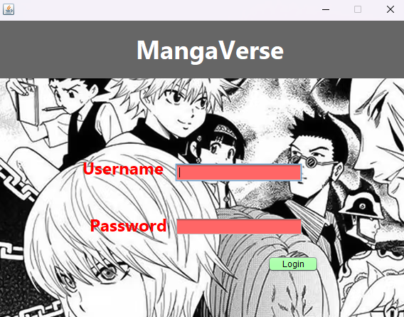
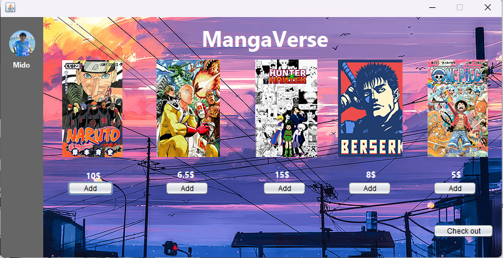

# Manga Store Project

This is a simple Manga Store project developed using NetBeans IDE. The project features a login form and a home form, allowing users to access the main content of the application.

## Features

- **Login Form**: Users can log in using their credentials.
- **Home Form**: After successful login, users are directed to the home form displaying the main content.

## ScreenShots

## Getting Started

To run this project on your local machine, follow these steps:

### Prerequisites

- NetBeans IDE (Download and install from [NetBeans website](https://netbeans.apache.org/download/index.html))
- Java Development Kit (JDK) (Download and install from [Oracle's website](https://www.oracle.com/java/technologies/javase-downloads.html))

### Installation

1. Download the project ZIP file from the repository from [releases]([https://netbeans.apache.org/download/index.html](https://github.com/simplehima/MangaVerse/releases/tag/v1.0.0))).

2. Extract the ZIP file to a location on your computer.

3. Open NetBeans IDE.

4. Click on **File** > **Open Project**.

5. Navigate to the extracted project folder and select it.

6. The project should now be loaded in NetBeans.

### Running the Project

1. In NetBeans, locate the project in the **Projects** pane on the left.

2. Right-click on the project and select **Run**.

3. The application should start. You will see the login form.

4. Enter the provided credentials (if any) to log in.

5. Upon successful login, you will be directed to the home form.

## Contributing

Contributions are welcome! If you find any issues or have suggestions for improvement, please open an issue or a pull request in this repository.

## License

This project is licensed under the [MIT License](LICENSE).
